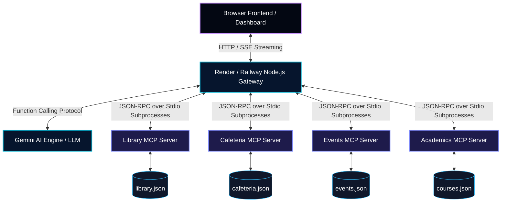

# IIT Roorkee Unified Campus Intelligence Hub

A premium, unified web dashboard featuring a central AI assistant powered by **Model Context Protocol (MCP)** and independent, live-querying servers. Instead of running fragile scrapers or populating a single centralized database, this platform queries isolated campus servers in real-time to locate library books, display cafeteria lunch menus, list campus calendars/events, and search academic directories.

This hub is localized specifically for **IIT Roorkee (IITR)** web portals and student services.

---

## 📌 Architecture Overview



### Key Architectural Concepts
1. **Dynamic Tool Translation**: On launch, the persistent backend gateway queries all active local MCP servers to inspect their tool capabilities. It dynamically maps these schemas directly into Google Gemini function declarations.
2. **Real-time Tool Routing Loop**: When a student asks a natural-language question, the Gemini engine decides which tool to call. The backend captures the function call, executes it on the corresponding local MCP subprocess via **Stdio JSON-RPC**, and pipes results back to Gemini.
3. **Hybrid Library Live Search**: The library node attempts to scrape the live Mahatma Gandhi Central Library (MGCL) Koha catalog at `https://opac.mgcl.iitr.ac.in`. If the university site times out or is offline, it cascades to our local catalog database.
4. **No Centralized SQL Database**: State belongs solely to the respective microservice. The Library, Cafeteria, Events, and Academics databases are separate tables (simulated via file-persisted JSON structures) and queried completely on-demand.
5. **Observer Observability Log Console**: Standard input/output communication logs are monitored, formatted, and streamed to the frontend dashboard console so that users can view JSON-RPC calls executing in real-time.

---

## 🌟 Key Features

* **3-Column Obsidian Dashboard UI**: Styled using custom, high-end dark glassmorphism effects and micro-animations.
* **Dual Routing Engine**: 
  - **Dynamic Gemini AI Router**: Uses Gemini API tool-calling to orchestrate execution streams.
  - **Local Offline Fallback Router**: Runs without an API key, parsing keyword tags to query the live MCP servers so the project remains testable out-of-the-box.
* **Self-Updating Visual Widgets**: Direct visual cards querying the cafeteria, library, and calendars independently of the chat prompt.
* **Server Status Panel**: Real-time status indicators (green/red) demonstrating the live connection health of individual sub-processes.
* **Observer Terminal**: Developer log box showing real-time stdin/stdout JSON-RPC data transmissions.

---

## 🛠️ Tech Stack

* **Frontend**: Next.js (React 19, App Router, TypeScript)
* **Styling**: Vanilla CSS (Premium Glassmorphism Design System)
* **MCP Integration**: Official `@modelcontextprotocol/sdk` (Node.js)
* **AI Orchestration**: Google Gemini API via `@google/generative-ai`
* **Fuzzy Search Engine**: `Fuse.js` for flexible user requests
* **Icons**: `lucide-react`

---

## 🚀 Setup & Execution Guide

### Prerequisites
* Node.js (v18 or higher)
* NPM

### 1. Installation
Clone the repository, navigate into the directory, and install the workspace dependencies:
```bash
npm install
```

### 2. Environment Variables
Create a file named `.env.local` in the root folder and add your Gemini API Key:
```env
GEMINI_API_KEY=your_gemini_api_key_here
```
*(If you do not have a Gemini API key yet, the application will automatically enter **Offline Fallback mode**, enabling you to test the live MCP tools using the keyword router!)*

### 3. Run Verification Tests
Verify that all 4 MCP servers are fully compiled, compatible, and executing JSON-RPC loops:
```bash
node test-all.js
```

### 4. Start the Application
Run the Next.js development server:
```bash
npm run dev
```
Open [http://localhost:3000](http://localhost:3000) in your browser to view the dashboard.

---

## 🌐 Production Deployment Guide

Spawning stdio child processes requires a **persistent container environment**. For production, deploy the project using a decoupled strategy:

### 1. Backend Gateway (Render / Railway)
Deploy the repository as a persistent Node.js web service.
* **Build Command**: `npm install`
* **Start Command**: `npm run start-gateway` (Starts the standalone HTTP/SSE server in `mcp-gateway-server.js` on port `$PORT`)
* **Env Variables**: Add `GEMINI_API_KEY` in your service settings.

### 2. Frontend (Vercel)
Deploy the Next.js frontend to Vercel as a standard client application.
* Update the base URLs in your React components to point to the backend Render server address.

---

## 📂 Project Directory Structure
* `mcp-servers/`: Holds the 4 standalone MCP server files (Stdio transports).
* `src/data/`: Houses the localized mock JSON datasets for all 4 services.
* `src/lib/`: Custom helpers:
  - `mcpClient.ts`: Next.js gateway that spawns the subprocess client connections.
  - `logger.ts`: Observability logger writing to the `/logs` directory.
* `src/components/`: Modular React dashboard columns and panels.
* `src/app/`: App router layouts and API endpoints.

---

## 🧪 Example Prompts to Test
Try asking the AI Assistant the following to trigger the different MCP servers:
* **Library (Web OPAC / Fallback)**: *"Search the MGCL library for deep learning and check if Clean Code is available."*
* **Cafeteria (Hostel Mess)**: *"What is on the breakfast menu at Rajendra Bhawan Mess and how long is the wait line?"*
* **Events (Fests)**: *"Tell me about the Cognizance hackathon and Thomso bands battle."*
* **Academics (CSE Directory)**: *"Where is Dr. Balasubramanian Raman's office and when are his office hours?"*
